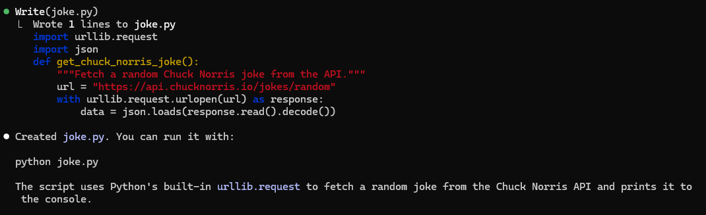
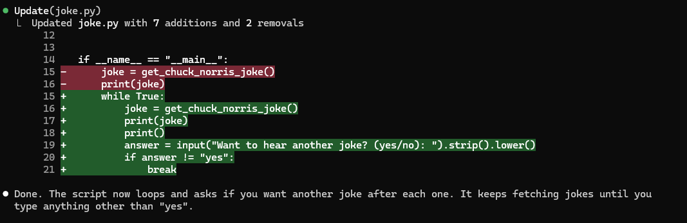

# Installing Claude Code

I already have Claude installed on this machine, but I'm going to just go over the installation with you, which is really straightforward.

## Create An Account

Now you do need an account. So make sure you create either a free account or a paid account at https://claude.com. I would really suggest the middle paid model because you'll probably run out of tokens otherwise, but you can try it if you want.

## Install The CLI

Installing the Claude Code CLI is simple. There are a few ways to do it. There's a native install, which is now the recommended way. You can run a Curl command on Mac, Windows and Linux. You can also use Homebrew on Mac and Powershell on Windows. You can also install it with NPM, which is what I usually do.

Once you install it, run the `claude` command in the terminal and you should be prompted to log in. It will redirect you to the website and you can confirm your login.

## Running Claude

Whenever you want to start a session, you simply type `claude` into the terminal. This could be in your standard terminal window or within VS Code's integrated terminal. I will almost always run it in the editor but I'm using the regular window just to show you this stuff.

Let's go ahead and make a new directory:

```bash
mkdir test-project
```

We'll just do some very simple stuff to start off with.

Type the following in your terminal:

```bash
claude
```

It will ask if you want to let Claude create and edit files. Type "Y"

Now you are in the interface. From here you can start to interact with Claude. Usually, you would have your editor open as well, but I just want to get you familiar with basic operation.

You can plan from here, have the agent write code, manage files, pretty much anything.

Let's do something simple and type the following:

```text
Create me a python script that will fetch a Chuck Norris joke from the api.chucknorris.io api. Do not use any 3rd party dependencies.
```

You will see a chunk of code pop up and it will ask if you want create the file. You'll have 3 selections:

1. Yes
2. Yes, allow all edits during this session
3. No, and tell Claude what to do differently

If you select 1, it will just create this file. If you select 2, then from now on, when you make similar requests, it will just create the file without needing your implicit approval. This is sometimes called "YOLO Mode" or "Autorun Mode".

## Auto Run

This is important to think about because you may not want it to stop and ask you for permission for everything, however, if you're not vibe coding and you want to understand, what's happening, then I would suggest not using yolo or autorun mode. If you're a beginner, then definitely don't use it. You want to at least take a glance at what's going on. If it's for things like search commands, then sure, 2 is fine, but to edit a file and write code, I would suggest leaving it off of autorun mode.

Then the 3rd option is if you want to specify something else. Like let's say we don't want the name it's giving us. I'll type 3 and then enter:

```text
Create the file but call it joke.py
```

It will then change the file and ask me to confirm. I'll say yes.



It creates the file and then tells me what it does. It uses the `urllib.request` to fetch a random joke and prints it to the console.

Now if you want to switch from auto-run mode to ask mode, you can click in the chat box where it says "Ask Before Edits" or just hit "Shift+Tab". This will toggle between those options as well as **plan mode**.


## Running Our File

So we created our first program with Claude Code.

If I want to run this file, you can exit and run it from your terminal, but you can also just run it right from here. You don't even have to use the actual python command, just tell Claude to do it:

```text
Run the file
```

you should see the file output, which would be a joke.

## Making Changes

Let's modify our joke script. Instead of just printing the joke, let's have it ask the user if they want another one.

```text
Update joke.py to ask the user if they want to hear another joke. If they type yes, fetch another one. Keep going until they type no.
```

Claude will show you the changes it wants to make. Review them and accept.

## Diffing

Now since we had Claude make a change, it shows us the diff.



Red lines are code being removed and green are code being added. As you can see, it is adding a while loop that will keep asking until we don't say yes.

If we try to run it again, we'll get a message saying that we can't run code that requires user input through the terminal. I suspect in the future, you'll be able to do this, but right now you can't.

So we could either exit or open a new terminal.

I'll open a new terminal. I need to go to the right place, so within Claude, I'll just type the `pwd` command to tell me the path. Then I'll copy that and go to that folder in my new terminal:

```bash
cd /path/to/folder
```

Now let's run the code:

```bash
python joke.py
```

It should show you a joke until you say no.

## Exiting Claude

ok, now if you want to leave the Claude interface, you have a couple options:

- Close terminal window
- Ctrl-C
- /exit

The last one, `/exit` is called a "Slash Command". Let's try that and in the next lesson, we'll talk more about slash commands.
