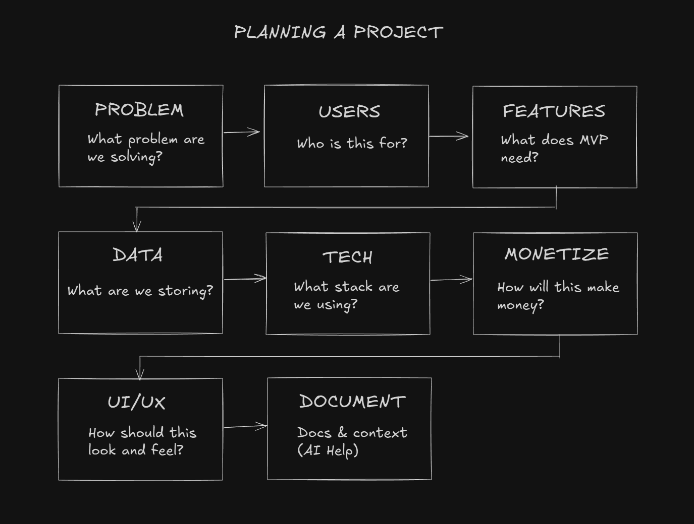

# Planning a Project From Scratch

Now we start the real work of building our app. Unlike with "vibe coding", we don't want to just open up an AI prompt and say build this. We want to carefully think of and map out what we want. Where we don't write as much or if any code at all when using AI, if you want to control the project and not vibe code, then you need to make that lack of writing code up with planning and documentation. So planning takes up a lot more time than it used to before using AI. Because you always knew what was going on because you were writing the code.

Everyone has their own process for this and ultimately, yours may be different than mine. I think this is a good general workflow for planning any coding project whether you are using AI or not:

1. Define the problem: What does this app offer people? What problem does it solve?
2. Who are the users that will be using this app?
3. What are the main features for the MVP (Minimum viable product)
4. What does the data look like?
5. What is the tech stack?
6. How will this app make money?
7. How should the app look and feel?
8. Document all of the above

You don't have to follow this to a tee, but it's a good general guideline.

I usually start by creating a project spec file with all the main features that I want. Obviously, this can change, but you want to have a good idea of how your project should work and document it.

Typically you're going to write this yourself with as many ideas and features as you can think of. It's important to be specific when working with AI, otherwise, you're not the architect, the model is. The model should be the builder, you're the architect.

You will have an attached file to this lesson called `project-spec.md`. Just keep it on hand because we will be using it and adding it to our context.

